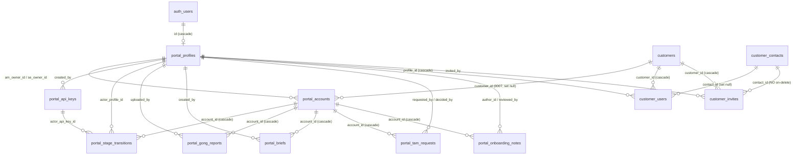
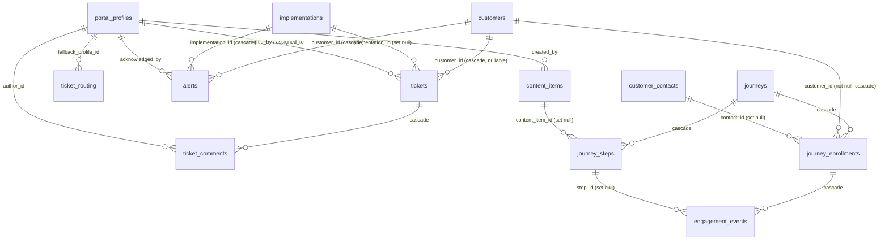

# Handoff Hub — Step 0 Audit

**Date:** August 29, 2026
**Stack correction:** the app is **TanStack Start (React + Vite SSR) + Supabase, deployed on Vercel** — *not* Next.js as the v2 brief states (`package.json:2,47-48,94`: `tanstack_start_ts`, `@tanstack/react-start 1.168.32`, `vite ^8.2.0`; `src/routes/api/v1/accounts.ts:5` notes routes were "Ported from the old Next.js app"). `NEXT_PUBLIC_*` env names survive only as compat fallbacks (`src/integrations/supabase/client.ts:38-45`). Migrations `supabase/migrations/0001-0008` are applied 1:1 to production and are the authoritative DDL.

---

## 1. Route map

| Path | File | Purpose | Reads | Writes | Access |
|---|---|---|---|---|---|
| `/` (root shell) | `src/routes/__root.tsx` | LAYOUT — app shell: head/meta, AuthGate, sidebar + lifecycle rail for internal users, bare shell for public/portal pages; 404/error boundaries | `portal_profiles` (client RLS, signed-in profile) | none | Wraps every route. Client redirects: unauthenticated → `/login`, customer role → `/portal`, internal kept off `/portal`; public prefixes `/login /signup /forgot-password /auth /view /tam` exempt |
| `/` | `src/routes/index.tsx` | "Today" triage home: implementations bucketed act-now / needs-attention / moving + recent activity | `getHome` → `hub.server.loadHome` (service-role): `implementations, customers, team_members, commitments, escalations, risks, issues, audit_log` | none | **Any valid JWT — no server-side role check** (customer role blocked client-side only) |
| `/access` | `src/routes/access.tsx` | Customer portal access: contacts who can sign in, pending invites, invite/revoke/remove | `getAccessOverview`: `customers, customer_users, customer_invites, customer_contacts, portal_profiles` | `inviteContact` → `customer_invites` + auth admin.generateLink + email; `revokeCustomerInvite` → delete; `removeCustomerAccess` → `customer_users` delete | Internal — server `requireInternal` on all four serverFns |
| `/admin` | `src/routes/admin.tsx` | LAYOUT — admin shell, client super-admin gate | `portal_profiles` (client role) | none | Client gate `isSuperAdmin` (admin/super_admin); children re-enforce server-side |
| `/admin/` | `src/routes/admin.index.tsx` | Admin landing: cards → API keys, users, ticket routing, CSV import | none | none | admin/super_admin via layout client gate only (no data) |
| `/admin/api-keys` | `src/routes/admin.api-keys.tsx` | Create/revoke scoped API keys; plaintext shown once | `getApiKeys` → `portal_api_keys` (+ `portal_profiles`) | `createApiKey`/`revokeApiKey` → `portal_api_keys`, `portal_audit_log` | super_admin — server `requireSuperAdmin` (admin\|super_admin) on every serverFn |
| `/admin/users` | `src/routes/admin.users.tsx` | List profiles, change roles | `getUsers` → `portal_profiles` | `setUserRole` → `portal_profiles.role` via CALLER's RLS client (so `portal_guard_role_change` sees `auth.uid()`; write-back verified) + `portal_audit_log` | super_admin — server `requireSuperAdmin` + DB trigger re-check |
| `/alerts` | `src/routes/alerts.tsx` | Alert feed (SLA breach, stalled, overdue milestone, external) + acknowledge | `getAlerts` → `alerts` (latest 200), `customers` | `ackAlert` → `alerts.acknowledged_at/by` | Internal — server `assertInternal` |
| `/api/cron/journeys` (GET/POST) | `src/routes/api.cron.journeys.ts` | Cron (`vercel.json` */30 min): advance delay steps, auto-enroll `customer_created` journeys, send step emails w/ signed `/view` tokens | `journeys, journey_steps, journey_enrollments, customers, customer_contacts, content_items, engagement_events` | `journey_enrollments`, `engagement_events` (email_sent), Resend email | `Authorization: Bearer ${CRON_SECRET}` (sha256 timing-safe), no session |
| `/api/cron/sla` (GET/POST) | `src/routes/api/cron/sla.ts` | Cron (hourly): SLA warn/breach on tickets, stalled >14d, overdue milestones; all passes deduped | `tickets, portal_profiles, alerts, implementations, customers, milestones` | `tickets` (sla_warned_at, sla_breached), `alerts`, `portal_audit_log` (cron.sla_sweep), emails | `Bearer ${CRON_SECRET}` via `cron-auth.ts` |
| `/api/tam/decision` (GET/POST) | `src/routes/api/tam/decision.ts` | One-click TAM approve/decline: GET renders auto-submitting form (prefetcher-safe); POST records decision | `verifyDecisionToken`, `portal_tam_requests` (status='pending' + jti), `portal_accounts` | `portal_tam_requests` (jti rotated = single-use, kills sibling link), `portal_audit_log`, requester email | Public URL; signed single-use JWT (`lib/server/tokens.ts`); expired/used → 400 |
| `/api/v1/accounts` (GET, POST) | `src/routes/api/v1/accounts.ts` | POST upserts presale account (Zapier/SF closed-won hook); GET lists (stage/updated_since, limit 500) | `portal_accounts`; POST also `portal_profiles` (owner email match) | POST → `portal_accounts` upsert (+ `portal_stage_transitions` on change) + `portal_audit_log`; GET audits `accounts.list` | API key: `accounts:write` / `accounts:read` |
| `/api/v1/accounts/:id` (GET) | `src/routes/api/v1/accounts.$id.ts` | One account (UUID or `sf_<id>`) + last 50 transitions | `portal_accounts, portal_stage_transitions` | none | API key: `accounts:read` |
| `/api/v1/accounts/:id/transition` (POST) | `src/routes/api/v1/accounts.$id.transition.ts` | Move account to new presale stage | `portal_accounts` | `portal_accounts.stage`, `portal_stage_transitions`, `portal_audit_log` | API key: `transitions:write` |
| `/api/v1/alerts` (POST) | `src/routes/api/v1/alerts.ts` | External systems report out-of-spec events; alert + manager email unless severity=info | `portal_profiles` (manager/admin/super_admin) | `alerts` insert, `portal_audit_log`, emails | API key: `alerts:write` |
| `/api/v1/tam-requests` (POST) | `src/routes/api/v1/tam-requests.ts` | Create TAM request; approval emails with signed one-click links | `portal_accounts`, `portal_profiles` (**role='admin' ONLY** — super_admin/manager get no approval email, `tam.ts`) | `portal_tam_requests`, `portal_audit_log`, approval emails | API key: `tam:write` |
| `/api/v1/tickets` (POST) | `src/routes/api/v1/tickets.ts` | Create ticket from external system; category routing, 24h SLA | `customers` (422 unknown_customer), `ticket_routing`, `portal_profiles` | `tickets` (sla_due_at), `portal_audit_log`, notification emails | API key: `tickets:write` |
| `/auth/callback` | `src/routes/auth.callback.tsx` | Landing for emailed auth links; PKCE exchange / hash tokens → `?next` | Supabase auth only | browser session | public |
| `/customers` | `src/routes/customers.tsx` | LAYOUT — passthrough | none | none | Internal (AuthGate client gate) |
| `/customers/` | `src/routes/customers.index.tsx` | Sortable implementations list + New Implementation dialog | `getHome` (as `/`); dialog `getTeamOptions` → `team_members` | `addImplementation` → `customers` (optional), `implementations`, `implementation_stage_history`; `uploadAttachment` → bucket `attachments` | **Any valid JWT — no server-side role check** |
| `/customers/:customerId` | `src/routes/customers.$customerId.tsx` | Customer 360 (tabbed) — post-sale core, own lifecycle rail, every write panel | `getCustomer360` → `loadCustomer360`: `customers, implementations, implementation_stage_history, customer_contacts, team_members, risks, issues, escalations, milestones, decisions, commitments, requirements, success_criteria(+observations), approvals, evidence, technical_solutions(+notes), field_mappings, trace_links, adoption_areas(+observations), graduations, cs_handoffs, journal_entries, audit_log` | Hub serverFns: implementations edit + SOW doc; `advanceImplementationStage` (launch gate); requirements/risks/issues/escalations/decisions/commitments; success_criteria(+obs); adoption_areas(+obs); evidence; approvals; customer_contacts; journal_entries; bucket `attachments`; SOW analyze/apply | **Any valid JWT — NO server-side role check; all writes on service-role admin client** |
| `/deals/:dealId` | `src/routes/deals.$dealId.tsx` | Presale deal record: stage history, Gong reports, notes, PPTX briefs, TAM requests, start-onboarding handoff | `getDeal` → `loadDeal`: `portal_accounts, portal_stage_transitions, portal_gong_reports, portal_onboarding_notes, portal_briefs, portal_tam_requests, portal_profiles` | Notes/reports CRUD; `generateBriefForDeal` → `portal_briefs` + bucket `portal-briefs`; `createTamRequestForDeal` (approver emails to legacy role 'admin' only); `startOnboardingForDeal` → `customers, implementations, implementation_stage_history` + `portal_accounts.customer_id` (+ closed_won → onboarding_kickoff); audits `portal_audit_log` | Read: any JWT. Writes: `requireInternal`. Deletes: author or admin/super_admin. startOnboarding: sales editor (admin/super_admin/manager/sales/am), closed_won+ only |
| `/forgot-password` | `src/routes/forgot-password.tsx` | Reset request + set new password | Supabase auth | Supabase auth | public |
| `/journeys` | `src/routes/journeys.tsx` | LAYOUT — passthrough (email drip section) | none | none | Internal (client gate) |
| `/journeys/` | `src/routes/journeys.index.tsx` | Journey list + create dialog; lazily seeds default journey | `getJourneys` → `journeys, journey_steps, journey_enrollments` | `addJourney`; side-effect `ensureDefaultJourney` (idempotent seed) | View: internal (`requireInternal`); create: `canEditJourneys` (admin/super_admin/manager/implementation/onboarding) |
| `/journeys/:journeyId` | `src/routes/journeys.$journeyId.tsx` | Step editor, content library, activation, per-contact enrollments | `getJourneyDetail` → `journeys, journey_steps, journey_enrollments, engagement_events, content_items, customers, customer_contacts` | steps CRUD, `toggleJourneyActive`, `addContentItem`, `enrollJourneyContact` (+ first email) | View: internal; edits/enroll: server `editorOnly` (canEditJourneys roles) |
| `/login` | `src/routes/login.tsx` | Internal password sign-in, customer magic link, optional Microsoft OAuth | Supabase auth | session | public |
| `/owners/:owner` | `src/routes/owners.$owner.tsx` | Per-owner leadership drilldown | `getLeadership` → `loadLeadership` (implementations, customers, team_members, commitments, escalations, risks, issues, audit_log) | none | **Any valid JWT — no role check** |
| `/pipeline` | `src/routes/pipeline.tsx` | Presale kanban, drag-to-stage, New Deal, Salesforce CSV import | `getPipeline` → `portal_accounts` (+ `portal_profiles`) | `moveDealStage` (`requireInternal`); `addDeal`/`importDeals` (`requireSalesEditor`) → `portal_accounts` upsert + transitions + audit | View: any JWT; stage moves: internal; create/import: admin/super_admin/manager/sales/am |
| `/portal` | `src/routes/portal.tsx` | LAYOUT — customer portal chrome | `getPortalHome` (header name) | none | Customer role (AuthGate); data scoped server-side by `customer_users` |
| `/portal/` | `src/routes/portal.index.tsx` | Customer progress: stage tracker, launch date, milestones, history | `getPortalHome` → `loadPortalHome` (customer ids from `customer_users`, never input): `customers, implementations, milestones, commitments, implementation_stage_history` | none | Customer via `customer_users`; zero-linked callers get an error, not data |
| `/portal/tickets` | `src/routes/portal.tickets.tsx` | Customer help center: submit + reply (internal comments hidden) | `getPortalTickets` → `customers, tickets, ticket_comments` (internal=false server-filtered), `portal_profiles` | `submitTicket` (membership verified); `replyTicket` (ownership verified; internal forced false) | Customer via `customer_users`; server-verified |
| `/portfolio` | `src/routes/portfolio.tsx` | Leadership rollup by owner and account | `getLeadership` | none | **Any valid JWT — no role check** |
| `/settings` | `src/routes/settings.tsx` | Static reference: lifecycle stages, exit criteria, roles; no serverFns | none (constants from `src/lib/lifecycle.ts`) | none | Internal (client gate only) |
| `/signup` | `src/routes/signup.tsx` | Internal signup; client domain allowlist (VITE_ALLOWED_EMAIL_DOMAINS), DB trigger authoritative | Supabase auth | Supabase signUp (`portal_profiles` via trigger) | Public (domain enforced by DB trigger) |
| `/technical-solutions` | `src/routes/technical-solutions.tsx` | LAYOUT — passthrough | none | none | Internal (client gate) |
| `/technical-solutions/` | `src/routes/technical-solutions.index.tsx` | Cross-customer solutions queue | `getTechnicalSolutions` → `technical_solutions, implementations, customers, requirements, field_mappings, technical_solution_notes, approvals, trace_links, decisions, team_members` | none | **Any valid JWT — no role check** |
| `/technical-solutions/:id` | `src/routes/technical-solutions.$id.tsx` | Solution detail: design, mappings, notes, trace, owner/status editors | `getTechnicalSolution` → 12 tables incl. `audit_log` | owner/status/design; notes; field mappings; signed attachment links | **Any valid JWT — no server role check** (UI intent tam_se/implementation via `canEditTechnical`, not enforced) |
| `/tickets` | `src/routes/tickets.tsx` | LAYOUT — tabs Queue/Routing/Alerts; Routing shown to managers | `portal_profiles` (client, tab visibility) | none | Internal (client gate); Routing link hidden unless `canManage` |
| `/tickets/` | `src/routes/tickets.index.tsx` | Internal queue: SLA countdowns, filters, new-ticket form | `getTickets` → `tickets, customers, portal_profiles` (customer callers scoped via `customer_users`); `getHome` for pickers | `addTicket` (routing, sla_due_at, emails, audit) | Internal full; customer callers scoped server-side per call |
| `/tickets/routing` | `src/routes/tickets.routing.tsx` | Routing rules per category + fallback | `getTicketRouting` → `ticket_routing`; `getInternalProfiles` | `setTicketRouting` + audit | View: internal; edit: `assertManager` (manager/admin/super_admin) server-enforced |
| `/tickets/:ticketId` | `src/routes/tickets.$ticketId.tsx` | Ticket thread, status, assignee, SLA chips | `getTicket` → `tickets, ticket_comments` (internal comments only for internal callers), `portal_profiles, customers` | `addTicketComment` (customer forced internal=false; internal customer-visible comment stamps `first_response_at` + email); status/assignee + audit | Internal full; customer: linked tickets only, server-enforced; status/assignee `assertInternal` |
| `/view/:token` | `src/routes/view.$token.tsx` | PUBLIC tracked-link landing for journey emails: records view (may advance journey), redirects; never throws | `recordJourneyView`: verify signed journey JWT; `journey_enrollments, journey_steps, content_items, engagement_events` (dedupe) | `engagement_events` (viewed), `journey_enrollments`, possible next-step email | Public — signed token only; **the sole serverFn without `requireSupabaseAuth`** |

**Cross-cutting authz gap:** every hub serverFn (`/`, `/customers/*`, `/portfolio`, `/owners/*`, `/technical-solutions/*`) requires only a valid Supabase JWT and runs writes on the service-role client — the customer role is kept out by the client-side AuthGate only (routes JSON; `src/routes/customers.$customerId.tsx` authz).

---

## 2. Database schema

### 2.1 Tables by domain

#### Presale portal (`portal_*`, migration 0001, hardened 0002/0005, widened 0008)

| Table | Purpose | Key columns | FKs | RLS |
|---|---|---|---|---|
| `portal_app_config` | Key/value config; holds signup domain allowlist read by signup trigger | `key` (text PK), `value` jsonb, `updated_at` (**no touch trigger**) | none | select internal, update admin (0005:334-341). No org_id |
| `portal_profiles` | One row per authenticated user; RBAC anchor | `id` PK, `email` unique, `full_name`, `role` (`portal_user_role`, default 'am' → 'sales' after 0005:51), `created_at` | `auth.users(id)` cascade | **select `using(true)` for all authenticated incl. customers** (0001:321-322, never tightened); update self-or-admin; no delete policy. Role-guard trigger (0001:302-303) |
| `portal_api_keys` | Hashed public-API keys | `id`, `name`, `key_prefix`, `key_hash` unique, `scopes text[]`, `last_used_at`, `revoked_at` | `portal_profiles` (created_by) | select admin-only; **no write policies** — service-role only (0001:369-370) |
| `portal_accounts` | Presale/pipeline account with stage machine | `id`, `name` (unique `lower(name)` idx), `domain`, `salesforce_id` unique, `stage` (`portal_account_stage` default 'prospect'), `arr`, `products text[]`, `summary`, `stage_entered_at`, `updated_at` | `portal_profiles` (am_owner_id, se_owner_id); `customers` (customer_id, **0007** — the presale→post-sale seam, set null) | Full CRUD internal, delete admin (0005:344-356). Touch trigger; **stage-guard trigger** — only `portal_transition_stage()` may change stage (0001:160-161) |
| `portal_stage_transitions` | Append-only stage history | `id`, `from_stage`, `to_stage`, `source` (`portal_transition_source`), `note`, `occurred_at`; idx (account_id, occurred_at desc) | `portal_accounts` cascade; `portal_profiles` (actor); `portal_api_keys` (actor) | Only select (internal, 0005:359-361); written solely by security-definer RPC or service role |
| `portal_gong_reports` | Gong call notes / account maps (markdown) | `id`, `report_type` (default 'call_notes'), `title`, `content_md`, `created_at` | `portal_accounts` cascade; `portal_profiles` (uploaded_by) | select internal, insert own, delete own-or-admin (0005:364-374) |
| `portal_briefs` | AI/template account briefs w/ PPTX | `id`, `status` (default 'queued'), `generator`, `structured_json`, `pptx_storage_path`, `error`, `source_report_ids uuid[]` (soft ref, no FK), `updated_at` | `portal_accounts` cascade; `portal_profiles` (created_by) | select internal, delete admin; no insert/update policies (service-role pipeline). Touch trigger |
| `portal_tam_requests` | TAM approvals decided via signed email token or portal | `id`, `requester_email`, `justification`, `urgency` (check low/med/high), `status` (default 'pending'), `token_jti`, `decided_at/via/note`; partial idx on pending | `portal_accounts` cascade; `portal_profiles` (requested_by, decided_by) | select internal, insert own, decide admin-only (0005:385-396) |
| `portal_onboarding_notes` | Onboarding notes with review workflow | `id`, `body_md`, `review_status` (default 'needs_review'), `reviewed_at`; partial idx needs_review | `portal_accounts` cascade; `portal_profiles` (author, reviewer) | select/update internal, insert own, delete own-or-admin (0005:399-413) |
| `portal_audit_log` | Presale-side audit trail (**distinct from hub `audit_log`**) | `id`, `actor_type` (check user/api_key/email_token/system), `actor_id` (untyped uuid, no FK), `action`, `entity_type/id` (polymorphic), `payload` jsonb | none | select admin-only (0001:372-373); no write policies (service-role only) |

#### Implementation hub (unprefixed, migration 0003, RLS tightened 0005)

| Table | Purpose | Key columns | FKs | RLS |
|---|---|---|---|---|
| `team_members` | Hub staff directory — **separate from `portal_profiles`**, role is free text, no auth link | `id`, `name`, `email`, `role` (text), `active` | `orgs` | Internal CRUD. Owner/actor for 19 hub tables; **no FK to auth.users or portal_profiles anywhere in 0001-0008** |
| `customers` | Post-sale customer account | `id`, `name`, `arr`, `external_id`, `industry`, `region`, `segment`, `source` (default 'manual'), `updated_at` | `orgs` | Internal CRUD + customer select via `customer_users` (0005:166-184). Touch trigger |
| `customer_contacts` | People at a customer | `id`, `name`, `email`, `role` (text), `notes`, `updated_at` | `orgs`; `customers` cascade | Internal CRUD + customer-scoped select (0005:208-226). Touch trigger |
| `implementations` | Central post-sale project | `id`, `current_stage` (**plain text — no enum, no guard, unlike portal_accounts**), `status` (**default 'active', no CHECK**), `stage_entered_at`, `tier`, `sow_*` (value/reference/signed_date/document_url/name), `contract_start_date`, `target/actual_launch_date`, `customer_goals`, `discovery_board_*`, `sales_owner` (text), `source`, `external_ref`, `updated_at` | `orgs`; `customers` cascade; `team_members` (owner_id, set null) | Internal CRUD + customer select via `customer_users` (0005:187-205). Touch trigger. Parent of 17 cascading children (0003) + `alerts` (cascade) + `tickets` (set null) (0006) |
| `adoption_areas` | Product-usage areas per implementation | `id`, `name`, `kind`, `intended_usage/users`, `in_use_definition`, `expected_frequency`, `notes`, `updated_at` | `orgs`; `implementations` cascade; `customer_contacts` (set null); `team_members` (set null) | Internal-only. Touch trigger |
| `evidence` | Proof artifacts | `id`, `title`, `type`, `description`, `url`, `related_entity_id/type` (polymorphic, no FK) | `orgs`; `implementations` cascade; `team_members` (set null) | Internal-only |
| `adoption_observations` | Point-in-time adoption state | `id`, `state`, `observed_at`, `notes`, `source`, `workaround_*` | `orgs`; `adoption_areas` cascade; `evidence` (set null); `team_members` (set null) | Internal-only |
| `approvals` | Customer sign-offs | `id`, `title`, `status` (default 'pending'), `approver_name/role`, `requested/decided_at`, `approved_entity_id/type` (polymorphic) | `orgs`; `implementations` cascade; `customer_contacts` (set null); `evidence` (set null) | Internal-only |
| `audit_log` | **Hub** field-level change history (distinct from `portal_audit_log`) | `id`, `entity_type/id` (not null), `field_name`, `old/new_value`, `change_reason`, `changed_at` | `orgs`; `team_members` (changed_by, set null) | Internal-only. **No writer anywhere** (§7) |
| `commitments` | Promises made to the customer | `id`, `description`, `committed_to`, `due_date`, `made_at`, `fulfilled_at`, `status` (default 'open') | `orgs`; `implementations` cascade; `team_members` (made_by, owner_id) | Internal CRUD + customer select via implementations join (0005:252-272) |
| `cs_handoffs` | One-to-one CS handoff record (`implementation_id` UNIQUE) | `id`, `handoff_date`, `summary`, `account_context`, `open_items` | `orgs`; `implementations` unique+cascade; `team_members` (cs_owner_id) | Internal-only. **No writer** (§7) |
| `decisions` | Decision log | `id`, `title`, `description`, `rationale`, `decided_by` (text, not FK), `decision_date`, `status` (default 'proposed') | `orgs`; `implementations` cascade | Internal-only |
| `issues` | Implementation issues | `id`, `title`, `description`, `severity` (default 'medium'), `status` (default 'open'), `raised/resolved_at`, `resolution` | `orgs`; `implementations` cascade; `team_members` (owner) | Internal-only |
| `risks` | Implementation risks | `id`, `title`, `likelihood/severity` (default 'medium'), `impact`, `mitigation`, `status` (default 'open'), `identified/resolved_at` | `orgs`; `implementations` cascade; `team_members` (owner) | Internal-only |
| `escalations` | Escalations, optionally linked to issue/risk | `id`, `title`, `escalation_type`, `severity`, `status`, `raised/resolved_at`, `resolution_summary` | `orgs`; `implementations` cascade; `team_members` (owner, raised_by); `issues`/`risks` (set null) | Internal-only |
| `graduations` | One-to-one graduation record (`implementation_id` UNIQUE) | `id`, `graduated_at`, `exit_criteria_summary`, `health_at_graduation`, `notes` | `orgs`; `implementations` unique+cascade; `team_members` (cs_owner_id) | Internal-only. **No writer** (§7) |
| `implementation_stage_history` | Stage history (text stages, app-written — **no DB guard**, unlike portal side) | `id`, `stage`, `entered_at` (not null, no default), `exited_at`, `notes` | `orgs`; `implementations` cascade; `team_members` (entered_by) | Internal-only |
| `journal_entries` | Per-implementation activity journal | `id`, `note`, `stage`, `links`, `attachment_name/url` | `orgs`; `implementations` cascade; `team_members` (author) | Internal-only |
| `milestones` | Milestones | `id`, `name`, `stage`, `status` (default 'not_started'), `target/completed_date` | `orgs`; `implementations` cascade; `team_members` (owner) | Internal CRUD + customer select via join (0005:229-249) |
| `requirements` | Scoped requirements | `id`, `title`, `category`, `priority` (default 'medium'), `scope_status` (default 'in_scope'), `status` (default 'proposed'), `source` | `orgs`; `implementations` cascade; `team_members` (created_by) | Internal-only |
| `requirement_scope_changes` | Scope-change requests | `id`, `change_type`, `description`, `reason`, `impact`, `decision/at/by` (text), `requested_at/by` (text), `effective_date` | `orgs`; `requirements` cascade | Internal-only. **Never touched by src/** (§7) |
| `success_criteria` | Measurable success criteria | `id`, `description`, `metric`, `baseline_*`, `target_value/date`, `measured_value/at`, `measurement_source`, `due_stage`, `status` (default 'not_started') | `orgs`; `implementations` cascade; `customer_contacts` (set null); `team_members` (owner) | Internal CRUD + customer select via join (0005:275-295) |
| `success_criteria_observations` | Measurements against a criterion | `id`, `observed_value` (not null), `assessment`, `observed_at`, `notes`, `source` | `orgs`; `success_criteria` cascade; `evidence` (set null); `team_members` (observed_by) | Internal-only |
| `technical_solutions` | Solution designs | `id`, `title`, `design_summary`, `configuration_details`, `status` (default 'draft'), `updated_at` | `orgs`; `implementations` cascade; `requirements` (set null); `team_members` (owner) | Internal-only. Touch trigger |
| `technical_solution_notes` | Typed notes on a solution | `id`, `content`, `note_type`, `links`, `attachment_name/url` | `orgs`; `technical_solutions` cascade; `team_members` (created_by) | Internal-only |
| `field_mappings` | Integration field mappings | `id`, `source_system/field`, `target_field`, `transformation_notes`, `required`, `status` | `orgs`; `implementations` cascade; `technical_solutions` (set null) | Internal-only |
| `trace_links` | Generic polymorphic entity-to-entity links | `id`, `from_entity_id/type`, `relationship`, `to_entity_id/type` (all not null, **no real FKs to linked entities**) | `orgs` only | Internal-only. **No writer** (§7) |

#### Tickets & alerts (migration 0006)

| Table | Purpose | Key columns | FKs | RLS |
|---|---|---|---|---|
| `tickets` | Support tickets w/ SLA + category routing | `id`, `category` (check technical/training/billing/data/integration/other), `subject`, `body`, `priority` (check low/normal/high/urgent, default 'normal'), `status` (check open/in_progress/waiting_customer/resolved/closed), `assigned_role`, `sla_due_at` not null, `sla_warned_at`, `first_response_at`, `sla_breached`, `resolved_at`, `submitter_email` | `orgs`; `customers` (nullable, cascade); `implementations` (set null); `portal_profiles` (submitted_by, assigned_to) | Internal full CRUD; customer select via `customer_users`; customer insert requires `submitted_by=auth.uid()` + link (0006:180-204). Touch trigger; partial idx open/in_progress |
| `ticket_comments` | Thread comments w/ internal flag | `id`, `body`, `internal` bool default false, `author_email`, `created_at` | `orgs`; `tickets` cascade; `portal_profiles` (author) | Internal full; customers select/insert `internal=false` only on their tickets (0006:208-240) |
| `ticket_routing` | Category → role routing | `id`, `category` unique, `route_role`, `created_at`; seeded: technical/integration→tam_se, training/data/other→implementation, billing→manager (0006:55-62) | `orgs`; `portal_profiles` (fallback_profile_id) | Internal-only |
| `alerts` | System/external alerts (sla_breach, stalled_implementation, overdue_milestone, external) | `id`, `kind`, `severity` (check info/warning/critical, default 'warning'), `title`, `detail`, `source` (default 'system'), `payload`, `acknowledged_at`, `notified_at`; partial idx unacked | `orgs`; `customers` cascade; `implementations` cascade; `portal_profiles` (acknowledged_by) | Internal-only |

#### Journeys / email sequences (migration 0006)

| Table | Purpose | Key columns | FKs | RLS |
|---|---|---|---|---|
| `content_items` | Reusable content library for journey emails | `id`, `title`, `kind` (check video/doc/link, default 'video'), `url` not null, `description` | `orgs`; `portal_profiles` (created_by) | Internal-only |
| `journeys` | Email drip sequence definitions | `id`, `name`, `description`, `trigger_event` (default 'manual'; comment names 'customer_created','stage_entered'), `active` default true | `orgs` | Internal-only |
| `journey_steps` | Ordered steps w/ email template | `id`, `step_order`, `title`, `email_subject/body` (`{{first_name}}`/`{{content_url}}`), `advance_on` (check viewed/delay, default 'viewed'), `delay_hours`; unique (journey_id, step_order) | `orgs`; `journeys` cascade; `content_items` (set null) | Internal-only |
| `journey_enrollments` | A contact enrolled in a journey | `id`, `contact_email` not null, `current_step` default 0, `status` (check active/completed/paused), `last_sent_at`; unique (journey_id, contact_email, customer_id) | `orgs`; `journeys` cascade; `customers` (not null, cascade); `customer_contacts` (set null) | Internal-only |
| `engagement_events` | sent/viewed/clicked tracking | `id`, `contact_email`, `event` (check sent/viewed/clicked), `payload` | `orgs`; `journey_enrollments` (nullable, cascade); `journey_steps` (set null) | Internal-only |

#### Access & tenancy (migrations 0003/0005)

| Table | Purpose | Key columns | FKs | RLS |
|---|---|---|---|---|
| `orgs` | Multi-tenancy root; seeded fixed org `00000000-0000-4000-8000-000000000001` = 'GoCanvas' which every `org_id` defaults to (0003:21-28) | `id`, `name`, `created_at` | none | Internal-only CRUD (0005:300-325 loop) |
| `customer_users` | **THE bridge** portal_profiles (auth) ↔ customers (hub); the RLS scoping join for `/portal` | `id`, `created_at`; unique (profile_id, customer_id) | `orgs`; `portal_profiles` cascade; `customers` cascade; `customer_contacts` (set null) | Only a select policy (self OR internal, 0005:67-69); **no write policies** — written by signup trigger (security definer) or service role |
| `customer_invites` | Pending customer-portal invitations | `id`, `email`, `accepted_at`, `created_at`; unique (email, customer_id) | `orgs`; `customers` cascade; `customer_contacts` (**no on-delete action** — deleting a contact with invites errors, unlike `customer_users.contact_id` set null; 0005:76 vs :61); `portal_profiles` (invited_by) | Internal-only CRUD (0005:84-92). Consumed by `portal_handle_new_user()`: invite email bypasses domain allowlist, creates 'customer' profile, inserts `customer_users`, stamps accepted (0005:111-136) |

### 2.2 ER diagrams (FK graph)

`org_id → orgs` edges (38 tables, §2.6) are omitted from all three diagrams for legibility; every unprefixed table below carries one.

**Domain A — presale portal + cross-domain bridge**

(`portal_audit_log` and `portal_app_config` have no FKs; `portal_briefs.source_report_ids` is a soft uuid[] ref to `portal_gong_reports` with no FK — 0001:226-241.)

**Domain B — implementation hub core**

```mermaid
erDiagram
  customers ||--o{ customer_contacts : "customer_id (cascade)"
  customers ||--o{ implementations : "customer_id (cascade)"
  team_members ||--o{ implementations : "owner_id"
  implementations ||--o{ adoption_areas : "cascade"
  implementations ||--o{ evidence : "cascade"
  implementations ||--o{ approvals : "cascade"
  implementations ||--o{ commitments : "cascade"
  implementations ||--o| cs_handoffs : "unique, cascade"
  implementations ||--o{ decisions : "cascade"
  implementations ||--o{ issues : "cascade"
  implementations ||--o{ risks : "cascade"
  implementations ||--o{ escalations : "cascade"
  implementations ||--o| graduations : "unique, cascade"
  implementations ||--o{ implementation_stage_history : "cascade"
  implementations ||--o{ journal_entries : "cascade"
  implementations ||--o{ milestones : "cascade"
  implementations ||--o{ requirements : "cascade"
  implementations ||--o{ success_criteria : "cascade"
  implementations ||--o{ technical_solutions : "cascade"
  implementations ||--o{ field_mappings : "cascade"
  adoption_areas ||--o{ adoption_observations : "cascade"
  evidence ||--o{ adoption_observations : "evidence_id (set null)"
  evidence ||--o{ approvals : "evidence_id (set null)"
  evidence ||--o{ success_criteria_observations : "evidence_id (set null)"
  customer_contacts ||--o{ adoption_areas : "customer_owner_contact_id"
  customer_contacts ||--o{ approvals : "customer_contact_id"
  customer_contacts ||--o{ success_criteria : "customer_owner_contact_id"
  requirements ||--o{ requirement_scope_changes : "cascade"
  requirements ||--o{ technical_solutions : "requirement_id (set null)"
  success_criteria ||--o{ success_criteria_observations : "cascade"
  technical_solutions ||--o{ technical_solution_notes : "cascade"
  technical_solutions ||--o{ field_mappings : "technical_solution_id (set null)"
  issues ||--o{ escalations : "related_issue_id (set null)"
  risks ||--o{ escalations : "related_risk_id (set null)"
  team_members ||--o{ audit_log : "changed_by"
  team_members ||--o{ adoption_areas : "owner_id"
  team_members ||--o{ evidence : "uploaded_by"
  team_members ||--o{ adoption_observations : "observed_by"
  team_members ||--o{ commitments : "made_by / owner_id"
  team_members ||--o{ cs_handoffs : "cs_owner_id"
  team_members ||--o{ graduations : "cs_owner_id"
  team_members ||--o{ escalations : "owner_id / raised_by"
  team_members ||--o{ implementation_stage_history : "entered_by"
  team_members ||--o{ issues : "owner_id"
  team_members ||--o{ risks : "owner_id"
  team_members ||--o{ milestones : "owner_id"
  team_members ||--o{ success_criteria : "owner_id"
  team_members ||--o{ success_criteria_observations : "observed_by"
  team_members ||--o{ technical_solutions : "owner_id"
  team_members ||--o{ technical_solution_notes : "created_by"
  team_members ||--o{ requirements : "created_by"
  team_members ||--o{ journal_entries : "author_id"
```

(`trace_links` FKs only to `orgs` — its from/to entity refs are untyped uuids, 0003:422-431. `team_members` and `portal_profiles` are **unlinked parallel people tables**: no FK or column connects them anywhere in 0001-0008.)

**Domain C — tickets, alerts, journeys**

### 2.3 Enums

All in 0001 except role additions in 0004; the hub side defines **zero** enums — every hub `status`/`stage` column is free text.

| Enum | Values | Used by |
|---|---|---|
| `portal_account_stage` | prospect, closed_won, onboarding_kickoff, in_onboarding, onboarding_complete (0001:8-9) | `portal_accounts.stage`, `portal_stage_transitions.from/to_stage` |
| `portal_transition_source` | ui, api, csv_import, system (0001:10) | `portal_stage_transitions.source`, `portal_transition_stage(p_source)` |
| `portal_user_role` | 0001: admin, am, se, onboarding; 0004 adds super_admin, sales, implementation, tam_se, manager, customer (ADD VALUE only — enum values can never be removed; 0004:1-18). am/se/onboarding are legacy; new internal signups default to 'sales' | `portal_profiles.role` |
| `portal_tam_status` | pending, approved, declined, expired (0001:12) | `portal_tam_requests.status` |
| `portal_brief_status` | queued, generating, complete, failed (0001:13) | `portal_briefs.status` |
| `portal_brief_generator` | llm, template (0001:14) | `portal_briefs.generator` |
| `portal_gong_report_type` | call_notes, account_map (0001:15) | `portal_gong_reports.report_type` |
| `portal_note_review_status` | needs_review, reviewed (0001:16) | `portal_onboarding_notes.review_status` |

### 2.4 Database functions & triggers

| Function / trigger | What it does | Evidence |
|---|---|---|
| `portal_handle_new_user()` + trigger `portal_on_auth_user_created` (after insert on auth.users) | Creates `portal_profiles` on signup. 0005 rewrite: matching `customer_invites` email bypasses domain allowlist → role 'customer' + `customer_users` links + invite stamped accepted; otherwise enforces `allowed_email_domains`; first user ever = 'admin', others = 'sales' (was 'am'). security definer; EXECUTE revoked from public/anon/authenticated | 0001:43-72; 0005:99-155; revokes 0002:9, 0005:158 |
| `portal_guard_role_change()` + trigger `portal_profiles_role_guard` | Raises on role change unless `portal_is_admin()` — belt-and-suspenders atop RLS | 0001:74-85, 302-303; 0002:10 |
| `portal_touch_updated_at()` | Generic updated_at toucher, shared by both schemas; attached to **exactly 8 tables**: portal_accounts, portal_briefs (0001:130-131, 240-241), adoption_areas, customer_contacts, customers, implementations, technical_solutions (0003:472-481), tickets (0006:28-29). `portal_app_config` has updated_at but no trigger | 0001:123-129; 0002:5 |
| `portal_guard_stage_change()` + trigger `portal_accounts_stage_guard` | Rejects any `portal_accounts.stage` change unless transaction-local `app.allow_stage_change='on'`, which only `portal_transition_stage()` sets — a guaranteed history row for every stage change (UI, API, CSV all funnel through it) | 0001:147-161; 0002:4 |
| `portal_transition_stage(...)` returns `portal_stage_transitions` | Security-definer stage-machine entry point: if `auth.uid()` present it overrides actor, forces source='ui', nulls api-key actor (anti-spoofing); locks row FOR UPDATE; no-ops on same-stage; flips guard, updates stage + `stage_entered_at`, inserts + returns history row. EXECUTE revoked from public/anon (anon has no auth.uid() and would pass the spoof guard) | 0001:163-210; 0002:18 |
| `portal_is_admin()` | RLS helper; originally role='admin' only, **redefined in 0008 to accept 'admin' OR 'super_admin'** — retroactively widening every admin-gated policy/trigger (api keys, TAM decide, config, role guard, deletes, audit read) | 0001:292-300; 0008:4-13 |
| `portal_role()` | Returns caller's role from portal_profiles; basis of the 0005 helpers | 0005:9-15 |
| `portal_is_super_admin()` | role in (admin, super_admin) — currently equivalent to post-0008 `portal_is_admin()` | 0005:17-23 |
| `portal_is_internal()` | Profile exists and role ≠ 'customer' — THE internal/customer boundary in nearly every post-0005 policy | 0005:25-31 |
| `portal_can_manage()` | roles admin/super_admin/manager — defined and granted but **referenced by no migration policy** (only docs/design/*) | 0005:33-48 |

RLS posture summary: (1) internal-only (largest group) — `portal_is_internal()` full-CRUD on orgs, team_members + a 22-entry hub loop (0005:300-325), the 7-table 0006 loop (0006:158-176), customer_invites, plus select on portal_* content; (2) customer-scoped — customers, implementations, customer_contacts, milestones, commitments, success_criteria, tickets, ticket_comments via `customer_users` (0005:163-295; 0006:180-240); (3) admin/definer-only — portal_api_keys, portal_audit_log, portal_stage_transitions, portal_briefs writes, portal_app_config update, TAM decide, account delete. **Residual openness: `portal_profiles` select remains `using(true)` for all authenticated users, customers included** (0001:321-322, never dropped in 0005-0008).

### 2.5 Storage buckets

`portal-briefs` and `portal-uploads`, both private (`public=false`); every download is a server-signed URL (0001:376-381). `portal_briefs.pptx_storage_path` points into `portal-briefs`. **No hub-side bucket and no `storage.objects` RLS policies are created in migrations** — yet code writes to an `attachments` bucket (`hub.server.ts:1675-1697`, `sow-analysis.server.ts:6,129`), which is therefore not provisioned by migrations.

### 2.6 The org_id tenancy seam

38 tables carry `org_id uuid not null default '00000000-0000-4000-8000-000000000001' references orgs(id)`: all 27 hub tables (0003), `customer_users` + `customer_invites` (0005:58,73), and all 9 tables of 0006. **No `portal_*` table has org_id, and no RLS policy filters on org_id** — single-org today, seam only (grep of 0005/0006 policy clauses finds no org_id). Org indexes exist only on customers, implementations, commitments, milestones, issues, risks, escalations (0003:437-443). Any real multi-tenant v2 must both extend the seam to the portal_* schema and start filtering on it.

---

## 3. Lifecycle stages

The brief asked: *"are they a DB table, an enum, a TS constant, or hardcoded in more than one place? List every location."* Answer: **there are two distinct stage systems, and the answer differs for each.**

### 3.1 System 1 — implementation lifecycle (post-sale)

**Canonical definition: a TS constant, defined exactly once.** `src/lib/lifecycle.ts:1-9` (the `LifecycleStageId` union) and `:59-126` (the ordered `LIFECYCLE_STAGES` array: `handoff, plan-internal, align-external, build, validate-iterate, launch, adopt, graduate-to-cs`), plus `LIFECYCLE_STAGE_MAP` (:133-135), legacy `STAGE_ALIASES` (plan, align, validate, prove-value, graduate, cs — :142-150) and pre-handoff labels (:44-57).

**The DB has zero authority:** `implementations.current_stage` and every stage column are plain `text` — no enum, no CHECK, no FK to a stages table (0003:75, 286, 299, 310, 355; generated types confirm plain string, `src/integrations/supabase/types.ts:746,788,949,998,1221`).

**Every location where the vocabulary is defined or duplicated:**

| # | Location | Form |
|---|---|---|
| 1 | `src/lib/lifecycle.ts:1-9, 59-126, 133-150` | The canonical TS union + array + map + aliases |
| 2 | `supabase/seed_demo.sql:24-45` | Raw literals in seed inserts (implementations, stage history, milestones) — hand-synced; DB would accept a typo |
| 3 | `src/lib/hub.server.ts:1404,1419` | `current_stage: "handoff"` + first history row `"handoff"` as literals (presale side derives the same thing as `LIFECYCLE_STAGES[0]!.id`, `presale.server.ts:478`) |
| 4 | `src/lib/hub.server.ts:271` | Graduation candidates via literal list `["adopt", "graduate-to-cs"]` |
| 5 | `src/routes/api/cron/sla.ts:159` | Terminal-stage check hardcodes `"graduate-to-cs"` (stalled pass :151-181) |
| 6 | `src/lib/launch-gate.ts:14` | `export const LAUNCH_STAGE = "launch"`, enforced at `hub.server.ts:1484` |
| 7 | `src/lib/graduation-readiness.ts:56-60,73` | Five literals via `idx("launch"/"align-external"/"validate-iterate"/"adopt"/"graduate-to-cs")` |
| 8 | `src/lib/customer360-derive.ts:232, 576-582` | `stageIndex("launch")`; `DEFAULT_PROVE_VALUE_DUE_STAGE` maps to `"align-external"/"launch"/"graduate-to-cs"` (progress % from `LIFECYCLE_STAGES.length` :114-118; `isCsStage` is phase-based, :97-100) |
| 9 | `src/lib/leadership.ts:492,496` | `findIndex(s => s.id === "build")` threshold |
| 10 | `src/routes/portfolio.tsx:695, 687` | `stageLabel("handoff")` + prose "eight owned stages"; hardcoded label "Adopt or Graduate to CS" |
| 11 | `src/lib/sow-analysis.server.ts:52` | LLM prompt example JSON hardcodes `"lifecycleStage":"handoff"` (the prompt otherwise injects ids from the array, :49) |
| 12 | `PLAN.md:19` | Full eight-stage sequence in prose (docs-only) |

Single-sourced consumers (no literals): `hub-format.ts:10-35` (normalizeStage/stageLabel/stageIndex), `stage-advance-input.ts:20-25` (nextLifecycleStage; the server's `advanceStage` accepts only the exact next stage but validates `toStage` as free string, `:12` + `hub.server.ts:1469-1480`), `portal.server.ts:152,161,249`, `presale.server.ts:478` (the sole bridge importing BOTH systems), `success-criterion-input.ts:4` (z.enum from the array), lifecycle-rail / portal stage-tracker / stage-advance dialog components, customers list filter, settings page, home-triage CTA (`home-triage.ts:245`).

Near-collisions that are NOT stages: "build"/"handoff" as technical-solution NOTE_TYPES (`solution-enums.ts:10-16`, `technical-solutions.$id.tsx:76-82`), "build"/"in_build" as solution statuses (`customer360-derive.ts:324,346`), "launch" as a sort key (`customers.index.tsx:19,118`).

### 3.2 System 2 — presale pipeline

**Definition: a DB enum AND a hand-written TS constant, unlinked.** The Postgres enum `portal_account_stage` (0001:8-9; prospect → closed_won → onboarding_kickoff → in_onboarding → onboarding_complete) is enforced hard: guard trigger blocks direct stage updates and `portal_transition_stage()` is the single write funnel (0001:150-210). But the same five values are re-declared by hand in `src/lib/presale-stages.ts:1-45` (`STAGES`, `STAGE_LABELS`, `STAGE_STYLES`, `isStage`) with **no generated link — the generated Supabase types contain zero `portal_` tables or enums** (grep of `types.ts` returns 0). Everything downstream derives from the TS array (`server/schemas.ts:2-27`, `presale.functions.ts:46`, `presale-types.ts`, API `isStage` checks, CSV import `presale.server.ts:196`).

Hardcoded presale literals in logic: `presale.server.ts:463-464` (`indexOf("closed_won")` gate), `:516-519` (closed_won → "onboarding_kickoff"), `server/accounts.ts:136` (default "prospect", duplicating the DB column default), `deals.$dealId.tsx:191-192`, `deal-board.tsx:44` (`!== "onboarding_complete"`), `seed_demo.sql:53-64` (enum-checked, unlike lifecycle seeds).

Journeys' `stage_entered` trigger_event references the *concept* of stage entry but stores/compares no stage id anywhere — the cron implements only `customer_created` auto-enrollment (`journeys.server.ts:373-379`; no `trigger_stage` field exists), so Journeys adds no third copy of either vocabulary.

### 3.3 Verdict on single source of truth

**No.** System 1 has one canonical TS definition consumed correctly by ~20 sites, but the id vocabulary is duplicated as raw literals in 10+ logic sites plus seed data, and the DB enforces nothing — any string can be written to `implementations.current_stage`. System 2 has exactly two parallel authorities (DB enum with a hard guard, and a hand-maintained TS array) plus literal gates/defaults, with generated types covering neither. A v2 template system must replace *both*: promote System 1 into data (template/stage tables or at minimum an enum + CHECK) and collapse System 2's TS copy into generated types.

---

## 4. Health

**Where set.** `implementations.status` has four writers:
1. Hub "new implementation": `createImplementation` inserts **without** a status key → DB default **'active'** (`hub.server.ts:1402-1404`; create input has no status field, `implementation-input.ts:24-68`).
2. Presale handoff: `startOnboarding` explicitly inserts `status: "on_track"` (`presale.server.ts:487`) — two creation paths, two vocabularies. Grep confirms these are the only two insert paths.
3. Manual editor (the only UI that changes it): EditImplementation offers exactly on_track/at_risk/blocked/idle; drafts default via `?? "on_track"` which does **not** catch 'active'; the `<select>` has no 'active' option so it renders unselected and re-submits 'active' unchanged (`implementation-write.tsx:505-510, 553, 632-641` → `setImplementation` → `updateImplementation`, `hub.functions.ts:269-274`, `hub.server.ts:1438-1445`).
4. Seed data uses on_track/at_risk (`seed_demo.sql:24-27`).

**DB default vs UI vocabulary mismatch — with a live defect.** `status text not null default 'active'` has **no CHECK constraint** (0003:93; no ALTER in 0004-0008), but `updateImplementationInput` validates `z.enum(["on_track","at_risk","blocked","idle"])` (`implementation-input.ts:81,94`). So any hub-created row still carrying 'active' **fails Zod on save**: the SOW editor and discovery-board editor blindly re-submit the current status through `setImplementation` (`sow-write.tsx:70,111`; `discovery-board-write.tsx:41,80,238,251`), so attaching a SOW or board to a hub-created implementation is rejected until someone manually re-picks a status — and even Edit details fails unless the user changes the empty status select. The comment claiming these are "the only status values the schema's CHECK constraint accepts" is false — there is no such constraint (`implementation-input.ts:80-81`; same false comment pattern in `adoption-input.ts:17-23`).

**"Nothing is computed today" is wrong — health IS computed.** `deriveHealth()` is a pure signal-derived health (`blocked/at_risk/on_track/no_signal`) that *explicitly never reads* `implementations.status` (`customer360-derive.ts:121-221`): open escalation sev≤1 or critical risk → blocked; risk/issue sev≤2, overdue commitments, launch date passed with no actual launch, stalled > STAGE_FLAG_DAYS, missed/at-risk milestone → at_risk; zero signals → no_signal; else on_track — each with a human-readable reason. The system is **hybrid**: derived health is what all chips and rollups show; manual status is a secondary flag whose only behavioral effects are Home triage overrides (blocked → act_now rank 0.5; at_risk → needs_attention; idle → wording only; `home-triage.ts:119-125, 257-273`) and the "Marked as"/"Manual flag" annotations.

**Where read.**
- Home `/`: StatusChip of the **derived** level + "Marked as: X" for the raw status when ≠ on_track — a hub-created row shows "Marked as: Active" (`index.tsx:125-130`).
- Customer 360: derived chip + "Manual flag: X" (`customers.$customerId.tsx:279, 327-332, 449-452`); raw status only feeds the three edit widgets (:408,496,518).
- Customers list: filter/sort/StatusDot use only derived health (incl. `no_signal`, which does not exist in the manual vocabulary; no 'idle'); a "Manual flag: X" annotation appears whenever raw ≠ derived (`customers.index.tsx:74-90, 104-113, 207-215`).
- Portfolio + owner pages: entirely derived rollups from `leadership.ts` (`healthByImplementation` at `home-triage.ts:53-65`; `leadership.ts:55-77, 236-259, 662-697`; `portfolio.tsx:252-272, 338-341`; `owners.$owner.tsx:49-59, 167-187`; `account-rows.tsx:42`).
- Cron: SELECTs status but never uses it — "stalled" is purely `stage_entered_at` > 14d + non-terminal stage (`api/cron/sla.ts:151-181`).
- DTOs: status is copied into every server DTO including the customer-portal payload (`hub.server.ts:57,350,608`; `portal.server.ts:171`) but the portal UI never renders it — raw status reaches customer sessions in JSON unused.
- Renderer fallback: StatusChip/StatusDot map exactly on_track/at_risk/blocked/idle/no_signal; anything else ('active') silently falls back to muted styling, enabled by the `ImplStatus = ... | string` widening (`record.tsx:5-38`; `hub-types.ts:1`).
- Dead: `urgencyRank()` ranks by manual status but has zero call sites (`hub-format.ts:79-91`).

**Net:** three vocabularies coexist for one column — DB default 'active' (0003:93), code enum on_track/at_risk/blocked/idle (`implementation-input.ts:81`), derived on_track/at_risk/blocked/no_signal (`customer360-derive.ts`) — and 'active' rows break the SOW/board/edit save path. Adjacent-but-distinct vocabularies not to conflate in a refactor: milestone statuses (missed/overdue/blocked/at_risk), adoption-area 'at_risk' (`adoption-input.ts:18-23`), and the sibling free-text-no-CHECK status defaults across 0003 (:160,188,213,227,243,261,311,326,362,390).

---

## 5. API surface & CSV import

The machine surface is exactly 9 raw-HTTP route files: 8 under `src/routes/api/` plus `src/routes/api.cron.journeys.ts` (flat-route name → `/api/cron/journeys`). `/view/$token` is NOT an API route — it is a public page that calls the `recordJourneyView` serverFn client-side and `window.location.replace()`s (`view.$token.tsx:7,25,32-33`).

### 5.1 Endpoints

| Route | Method | Auth | Purpose |
|---|---|---|---|
| `/api/v1/accounts` | POST | API key `accounts:write` | Upsert presale account (Zapier/SF closed-won hook). Body `accountUpsertSchema`: name required; salesforce_id?, domain? (lowercased), stage? (5-value enum), arr? (≥0), products?, am/se_owner_email? (resolved to profile ids, **silently dropped if unmatched**), summary? ≤10000. 201 created / 200 updated; 422/500. Audits `account.upsert` (+ `stage.transition` on change; creation writes a from_stage-null history row) (`accounts.ts:9-45`; `server/accounts.ts:34-168`) |
| `/api/v1/accounts` | GET | API key `accounts:read` | List; `stage` (isStage or 422) + `updated_since` (ISO or 422); ordered updated_at desc, **hard limit(500), no pagination cursor**. Audits `accounts.list` — the only read endpoint that audits (`accounts.ts:47-87`) |
| `/api/v1/accounts/{id}` | GET | API key `accounts:read` | One account (UUID or `sf_<salesforce_id>`) + last 50 transitions. 404 unresolved. **No audit row** (`accounts.$id.ts:8-33`) |
| `/api/v1/accounts/{id}/transition` | POST | API key `transitions:write` | `{to_stage (enum), note? ≤2000, occurred_at?}`; calls `portal_transition_stage` RPC (source 'api', actor=api key); `{changed,...}`, changed=false on same-stage; audit only when changed (`accounts.$id.transition.ts:13-46`; `server/accounts.ts:45-75`) |
| `/api/v1/tam-requests` | POST | API key `tam:write` | Create TAM request (account_id UUID or sf_; justification ≥10 chars; urgency default medium). Emails approvers one-click links (signed HS256 JWT, action+id+single-use jti, 7-day exp, `TAM_TOKEN_SECRET`). **Approver query is `role='admin'` only — super_admin/manager get no email** (`tam-requests.ts:14-49`; `server/tam.ts:63`) |
| `/api/tam/decision` | GET+POST | Signed single-use JWT | GET verifies + renders auto-submitting interstitial (mail-prefetcher-safe); POST does guarded update (`status='pending' AND token_jti = jwt.jti`, jti rotated → sibling link dies). Self-contained HTML 200/400. Audits `tam.approve/decline` actor_type 'email_token'; requester emailed (`decision.ts:46-114`) |
| `/api/v1/tickets` | POST | API key `tickets:write` | Create ticket: customer_id? pre-checked (422 unknown_customer), implementation_id? **not existence-checked**, category enum, subject 1-300, body 1-20000, priority default normal, submitter_email required. Canonical `createTicket`: routes by `ticket_routing.route_role`, load-balances by fewest open tickets, fallback profile, `SLA_HOURS = 24`, auto-ack + notify emails. Audits `ticket.create` (`tickets.ts:9-71`; `tickets.server.ts:74,186-298`) |
| `/api/v1/alerts` | POST | API key `alerts:write` | External alert: kind default 'external', severity default warning, title required; customer/implementation ids **not existence-checked**. Emails MANAGER_ROLES (manager/admin/super_admin) unless severity=info; stamps notified_at. Audits `alert.create` (`alerts.ts:11-60`; `tickets.server.ts:110,586-653`) |
| `/api/cron/sla` | GET+POST | `Bearer ${CRON_SECRET}` (SHA-256 + timingSafeEqual; 500 if unset; `cron-auth.ts:4-24`) | Hourly (`vercel.json`). Four idempotent passes: warn past 50% of first-response window; breach → sla_breached + critical alert + manager emails; stalled >14d non-terminal; overdue milestones (notify=false). Audits one `cron.sla_sweep` row + per-alert rows (`sla.ts:19-245`) |
| `/api/cron/journeys` | GET+POST | Same bearer check but **inlined, duplicating cron-auth.ts** | Every 30 min. `advanceDelayedSteps()` + `autoEnrollNewCustomers()`. **No run-level summary audit row** (unlike sla's `cron.sla_sweep`); per-item audits deeper: `journey.step_sent`, `journey.enrolled` (`api.cron.journeys.ts:11-45`; `journeys.server.ts:192-198, 249-255`) |

Auth-mechanism summary: (a) API-key scoped — all six `/api/v1/*`; (b) signed single-use JWT — `/api/tam/decision`; (c) CRON_SECRET bearer — both crons; (d) no auth — `/view/$token` (token-addressed, AuthGate-exempt via PUBLIC_PREFIXES, `auth-gate.tsx:5`). **No machine endpoint uses Supabase session auth.** API-key routes share the `{error:{code,message}}` envelope; TAM decision returns HTML; crons return plain text/JSON outside the envelope.

### 5.2 API key mechanics

Format `gcp_live_` + 32 random bytes base64url; only SHA-256 hex stored (`key_hash` unique) + `key_prefix` (first 12 chars) for display. Creation via `createApiKeyRecord` (requireSuperAdmin = admin|super_admin) filters scopes against `API_SCOPES` (throws if none survive), audits `api_key.create`, returns plaintext **exactly once**. Verification: `requireApiKey` accepts `Authorization: Bearer` OR `x-api-key`, hashes, rejects unknown/revoked (401) and missing scope (403), fire-and-forgets an unawaited `last_used_at` stamp. Revocation sets `revoked_at` (guarded), audits. **No expiry, no rate limiting, no IP restriction anywhere in the auth path.** Seven scopes: accounts:read/write, transitions:write, tam:write, tickets:write, alerts:write, and `reports:write` — defined and offered in the admin UI ("Push usage reports") but **required by no route** (`server/api-auth.ts:6-66`; `presale.server.ts:31,540-595`; grep hits only api-auth.ts:13 + admin.api-keys.tsx:22).

### 5.3 CSV import

`importDealsCsv` (session-auth, `requireSalesEditor` = admin|super_admin|manager|sales|am): 2MB cap, PapaParse header:true. Headers lowercased and stripped of `[\s_-]`, then mapped via `COLUMN_ALIASES` — the complete table:

| CSV header (normalized) | Maps to |
|---|---|
| name / account / accountname ("Account Name") | name |
| salesforceid / sfid | salesforce_id |
| domain / website | domain |
| stage | stage |
| arr | arr |
| amowneremail / owneremail | am_owner_email |
| summary | summary |

Unrecognized columns silently dropped; empty cells skipped. `arr` strips `$`/commas then Number() (NaN → field dropped, row still imported); `stage` normalized (lowercase, spaces/hyphens → underscores) and must pass `isStage` or the **row** is rejected ("Unknown stage"). Each row runs through `accountUpsertSchema` and the same `upsertAccount` as the API (source 'csv_import', actorProfileId = importer). Returns `{created, updated, stage_changes, errors[{row: i+2, message}]}`. **Not importable via CSV: products, se_owner_email, any opportunity id** (`presale.server.ts:130-226`).

### 5.4 Current idempotency semantics

Match precedence in `upsertAccount` (shared by API POST and CSV): (1) exact `portal_accounts.salesforce_id` equality when supplied; (2) case-insensitive name equality via `.ilike("name", input.name)` (no wildcards), backed by the unique `lower(name)` index; `salesforce_id` also column-unique. If a request omits salesforce_id but name-matches, the row is updated and **salesforce_id can be set/overwritten on a name-matched row** (spread into the update, `server/accounts.ts:83-115`). **There is no `salesforce_opportunity_id` anywhere in schema or code** — repo-wide grep for "opportunity" matches only a seed note string and a settings.tsx description; the only SF identifier is `portal_accounts.salesforce_id` (accepted in body and as `sf_<id>` path form). The brief's opportunity-id idempotency is therefore a **new column + new match key**, not a rename. Implementations have no SF column at all — only `external_ref` (0003:82).

### 5.5 Audit coverage

`portal_audit_log` actions written today: account.upsert, accounts.list, stage.transition (only when changed), account.start_onboarding, tam.request, tam.approve/decline, ticket.create/comment/status/assign, ticket_routing.update, alert.create/acknowledge, cron.sla_sweep, api_key.create/revoke, profile.role_change, brief.generate, customer.invited/invite_revoked/user_removed, journey.* (step_sent, enrolled, viewed, created, activated/paused, step_updated/added/deleted). Gaps: GET `/api/v1/accounts/{id}` unaudited; journeys cron has no run-level row; and `audit()` swallows all errors (fire-and-forget try/catch, `server/audit.ts:24-27`) — audit writes are best-effort, never transactional with the mutation.

---

## 6. Vocabulary inconsistencies

1. **Product name — at least four names split systematically by page family.** "GoCanvas Handoff Hub": README.md:1, PLAN.md:1, `__root.tsx:88,94`, pipeline/deals/admin/auth pages, `app-sidebar.tsx:25`. "Implementation Hub": every post-sale page title (index.tsx:28, customers.index.tsx:32, customers.$customerId.tsx:147, technical-solutions, tickets, journeys, access, alerts, settings, portfolio, owners) plus docs/MONDAY.md:16-17 and docs/V2-BRIEF.md:1,5 (which also mislabels the stack Next.js). Root meta: "Internal Implementation Operating System" (`__root.tsx:92`) vs og:description "Internal operating system for customer implementations" (:97). The brief itself flags the Handoff-vs-Implementation split (V2-BRIEF.md:21).
2. **Two more names on outbound/customer surfaces:** emails signed "GoCanvas Handoff Portal" (`server/email.ts:22`, `server/tam.ts:111`); customer portal calls itself the "GoCanvas onboarding portal" (`portal.tsx:11,66`, `access.server.ts:170`).
3. **Predecessor name "Implementation Path"** still describes live surfaces in docs (PLAN.md:7,19; README.md:42).
4. **Final stage: one id, two labels.** Id `graduate-to-cs` (`lifecycle.ts:9,118`); canonical label "Handover to Customer Success" (:119); but "Graduate to CS" rendered in `portfolio.tsx:655,687`, `hub-types.ts:82`, `customer360-derive.ts:574`; raw id in logic at `hub.server.ts:271`, `sla.ts:159`, `graduation-readiness.ts:60`; aliases "graduate"/"cs" (:148-149).
5. **End-of-lifecycle: three vocabularies over TWO tables.** "Graduation" (`graduations` table 0003:266, graduation-readiness module, PLAN/README) vs "handover" (UI: "Ready to hand over", "No handover record exists yet", `customers.$customerId.tsx:673-751`, `portfolio.tsx:653`) vs "CS handoff" (`cs_handoffs` table 0003:192; `hub.server.ts:563-572`). Meanwhile "handoff" also names the FIRST stage (sales→implementation, `lifecycle.ts:61-68`) and the sidebar Pipeline hint ("Deals & handoff", `app-sidebar.tsx:11`) — the same word marks both ends of the lifecycle. `graduation-readiness.ts` reads `cs_handoffs` into a variable named `handoff` and renders it as the "Handover record" (:343-471).
6. **"TIS" — 21 unexpanded occurrences in src/,** including user-visible copy ("TIS journal" panel, `customers.$customerId.tsx:1305`; "Waiting on TIS to…" reasons, `customer360-derive.ts:433-457,497`; "adjusted by TIS", `sow-analysis.ts:354,394`; "a TIS must confirm", `sow-pdf.ts:114`; "accepted by TIS", `lifecycle.ts:63`). Never expanded in any code, UI string, or authored doc — the only spelled-out form ("Technical Implementation Specialist") is a prior audit agent's guess in `docs/design/raw/audit-agents-wf_b79b445c.jsonl`. V2-BRIEF.md:21 calls it "the unexplained acronym". Context: the implementation-side owner role.
7. **"Journey" names two unrelated things that collide in the UI.** Email-drip feature: nav "Journeys", `/journeys` routes, `journeys/journey_steps/journey_enrollments` tables (0006:101-140), journey cron. Lifecycle sense: Customer 360 tab id+label "journey"/"Journey" (`customers.$customerId.tsx:110,122,1229-1232`), leadership links `?tab=journey` (`portfolio.tsx:506-543`, `graduation-readiness.ts:81-367`), SOW schema field `proposedJourney` rendered "Proposed journey from the SOW" (`customers.$customerId.tsx:1279-1282`, `sow-analysis.ts:202-394`), "implementation journey"/"company journey"/"account journey" in settings/PLAN/README. A user on the 360 "Journey" tab sees a "Proposed journey from the SOW" panel unrelated to `/journeys` one nav click away.
8. **Post-sale object = "customer" / "implementation" / "account" interchangeably, sometimes on one screen.** Nav "Customers / All implementations" (`app-sidebar.tsx:12`); "One row per customer implementation" (`customers.index.tsx:147-148`); leadership calls the same rows "Accounts" (`AccountRowList`, "Accounts needing attention", `portfolio.tsx:282-315`, `owners.$owner.tsx:190-221`, `account-rows.tsx:20-25`, `leadership.ts:151,273`) while also saying "No implementation is in Adopt…" (`portfolio.tsx:687`) — even though "account" elsewhere means a presale `portal_accounts` row; the customer portal frames it as "your onboarding"/"Your implementation" (`portal.index.tsx:31-42`).
9. **Presale: "deals" in the UI, "accounts" everywhere below.** Routes `/pipeline` + `/deals/$dealId` with "deals" copy vs table `portal_accounts`, types `Account/AccountStage`, audit entity_type "account", public API `/api/v1/accounts`; mixed in single expressions (`PipelineDeal extends Account`, `presale.server.ts:78`; New-deal dialog "Creates a presale account in Prospect" navigating via `result.account.id`, `deal-dialogs.tsx:70-84`).
10. **Concrete defect from that split: TAM approval emails deep-link to `${appUrl()}/accounts/{id}?tab=tam` — a route that does not exist** (`server/tam.ts:74`; `routeTree.gen.ts` has `/deals/$dealId` and the `/api/v1/accounts` JSON endpoints but no `/accounts/$id` page; `accounts.$id.ts:3-4` confirms the path came from the old Next.js app). Every TAM email's "open in portal" link 404s.
11. **"Onboarding" is quadruply ambiguous:** the presale stage tail (Onboarding Kickoff / In Onboarding / Onboarding Complete, `presale-stages.ts:4-16`), the presale notes table `portal_onboarding_notes`, the customer-portal experience ("your onboarding", `portal.tsx:11,66`), and the Journeys sidebar hint "Automated onboarding" (`app-sidebar.tsx:15`) — while the hub calls the same post-sale work "implementation".
12. **"Portal" itself is triple-overloaded:** (1) the `portal_` prefix = v1 presale schema + app-wide infrastructure (`portal_profiles` holds ALL users including internal staff); (2) "the portal"/"customer portal" = the `/portal` surface ("Portal invites", `app-sidebar.tsx:16`, `access.tsx:30,120`); (3) "Handoff Portal"/`portalUrl`/repo name `GCinternal-Portal`/README "One portal" = the whole internal app — so an internal staff row lives in `portal_profiles` while "portal users" in the Access UI means customers only, and `tam.ts`'s `portalUrl` is an internal deep link.

---

## 7. Dead weight

### 7.1 Unused tables (exhaustive — diff of all `create table` names vs all 251 `.from("...")` literals in src/)

- **`requirement_scope_changes`** (0003:330): never read or written by any code — appears only in generated types and migration RLS lists.
- **`orgs`** (0003:21): never queried; sole runtime role is the seeded row serving as the FK default for org_id.
- **`portal_app_config`** (0001:21): never touched by src/; read only DB-side by the signup trigger (0001:53, 0005:140).

### 7.2 Read-only tables with no writer (UI renders data nothing can create)

- **`trace_links`**: three reads (`hub.server.ts:420,838,922`), zero inserts anywhere — the traceability spine the app renders cannot be populated.
- **`graduations`**: one read (`hub.server.ts:565-570`) feeding graduation-readiness; no code or trigger creates rows.
- **`cs_handoffs`**: one read (`hub.server.ts:571-577`); `graduation-readiness.ts:359-368` renders the handover record if rows exist, but nothing creates them.
- **`audit_log`** (hub): displayed in three loaders (`hub.server.ts:101, 783-800, 934`; rendered `customers.$customerId.tsx:2181`) with **no app insert and no DB trigger** — history views can only show legacy/manual rows.

### 7.3 The split-brain audit (v1/v2 redundancy #1)

The hub UI reads the audit table nothing writes (`audit_log`), while all writes go to the audit table nothing reads (**`portal_audit_log`** — single write path `server/audit.ts:16`, imported by 11 files; zero selects in src/; an admin-read RLS policy exists, 0001:372, but no UI queries it). Migration 0003:13 flags the duplication itself: "audit_log vs portal_audit_log, team_members vs users."

### 7.4 Other v1/v2 redundancies

- **Two stage systems, both active** (§3): guarded presale `portal_accounts.stage` + `portal_stage_transitions` vs unguarded hub `implementations.current_stage` + `implementation_stage_history`; the presale tail (onboarding_*) semantically overlaps the hub lifecycle; `lifecycle.ts:136-142` keeps legacy STAGE_ALIASES "permanently".
- **Two note systems, both active:** `portal_onboarding_notes` (deal-level, `presale.server.ts:272-440` + brief generation input) vs `journal_entries` (implementation-level, `hub.server.ts:584,1662`).
- **Two people tables, both active, unlinked:** `portal_profiles` (auth/RBAC, 9 src files) vs `team_members` (hub ownership, `hub.server.ts:27,304,940,1365`); no FK/column links them (0003:13 accepts this).
- **Legacy roles am/se/onboarding persist end-to-end:** enum born as ('admin','am','se','onboarding') and enum values are add-only (0001:11; 0004:8-20); app code carries them with remapped labels (am→'Sales', se→'TAM / SE', onboarding→'Implementation', `auth.ts:6-34`) and in permission checks (`canEditSales` accepts 'am', `auth.ts:48`); 0005 signup assigns 'sales'.

### 7.5 TODOs

**Zero.** No TODO/FIXME/HACK/XXX comments exist in src/, supabase/, or config; the only 'TODO' string in the repo is prose in docs/V2-BRIEF.md:22 describing this audit.

### 7.6 Dead code

- `src/lib/error-capture.ts` — entirely dead file; nothing imports it, and its header names a `server.ts` consumer that does not exist (entry is `src/start.ts`).
- `getImplementations` (`hub.functions.ts:90-93`) — exported serverFn with zero importers (inner `loadImplementations` stays live via other paths).
- `isInternal` and `canEditTechnical` (`auth.ts:44,50`) — defined, exported, never referenced (siblings canManage/isSuperAdmin ARE used).
- `STAGE_STYLES` (`presale-stages.ts:20`) — dead despite its comment claiming board/badge usage; deal-board.tsx doesn't import it.
- `adoptionAreaLevels` (`leadership.ts:521`) and `urgencyRank` (`hub-format.ts:80`) — exported, zero call sites.
- 18 exports referenced only inside their defining file (export keyword dead, code live): hashKey, requireCustomerIds, sendStep, signJourneyToken, MANAGER_ROLES, SLA_HOURS, requireSalesEditor, requireSuperAdmin, useSession, sowTotalWeeks, leadershipAction, solutionAcceptance, stageSchema, IMPLEMENTATION_STATUSES, newCustomerInput, RELATED_ENTITY_TYPES, DEFAULT_PROVE_VALUE_DUE_STAGE, NEXT_ACTION_UNKNOWN.
- **41 of 46 shadcn components in `src/components/ui/` are dead.** Only button, dialog, input, label, tooltip are imported by app code; 37 files have zero importers; separator/sheet/skeleton/toggle are transitively dead (imported only by the themselves-unimported ui/sidebar.tsx and ui/toggle-group.tsx). `app-sidebar.tsx` is hand-rolled and imports nothing from ui/.
- `src/hooks/use-mobile.tsx` (the only file in src/hooks) — imported solely by the dead ui/sidebar.tsx.

### 7.7 Reachability

No page route is unreachable: 10 sidebar links, tab bars, admin cards, dialog navigations, journey email links (`/view/$token` built at `journeys.server.ts:171`), AuthGate customer redirect (`/portal`), auth links — all verified entry points. All non-ui components have importers. Both crons are registered in vercel.json (`/api/cron/sla` hourly, `/api/cron/journeys` */30). Method caveat: findings are grep-based with dynamic `await import(...)` accounted for (hub.server, presale.server, sow-analysis.server, server/brief/generate are dynamically imported and live); storage buckets used are `attachments` and `portal-briefs`.

---

## 8. Brief vs. reality

| Brief claim | Reality | Impact on plan |
|---|---|---|
| "Next.js + Supabase" | TanStack Start (React + Vite SSR) + Supabase on Vercel (`package.json:2,47-48,94`; api routes note the Next.js port, `accounts.ts:5`) | All framework-specific work items (routing, serverFns, SSR, middleware) must target TanStack Start; no Next.js conventions apply |
| "/tickets is broken in production: Missing Supabase environment variable(s): SUPABASE_URL, SUPABASE_PUBLISHABLE_KEY" | Stale: all three client factories fall back to hardcoded literal URL + publishable key (`client.ts:33-46`, `auth-middleware.ts:39-47`, `client.server.ts:34-37`), so that exact failure is unreachable. The only var without a fallback is the service key (`client.server.ts:38-49`), which the whole server data layer needs | Drop the named bug; keep the startup-env-check ask, scoped to `SUPABASE_SERVICE_ROLE_KEY`/`SUPABASE_SECRET_KEY` — and decide whether the hardcoded fallbacks should stay |
| "Auth and RBAC do not exist" | Full Supabase Auth + 10-role RBAC + RLS + role-management UI exist: AuthGate (`auth-gate.tsx:5-45`), server auth middleware (`auth-middleware.ts:33-118`), role helpers (`auth.ts:6-52`), DB helpers + tightened policies (0005:9-48, 161-324), `/admin/users` (`admin.users.tsx:69-128`), customer scoping (`portal.server.ts:36-54`) | Re-scope the workstream to what's actually missing: "my accounts vs all" filtering, per-role granularity WITHIN internal (DB treats all internal roles identically for writes), and server-side role checks on hub serverFns (§1 gap) |
| Quoted strings "No auth yet — this is the whole portfolio…" and "Team & roles … Not available yet" | Strings exist (`portfolio.tsx:693-694`; `settings.tsx:99-103`, brief's casing inexact) but both are stale copy contradicted by the working auth system; `settings.tsx:34`'s "roles drive no permissions" is true only of descriptive lifecycle roles | Fix is copy cleanup + team filtering, not building auth |
| "/access invites customer contacts, but there is nothing for them to see"; "the external half is zero" | An authenticated customer portal exists at `/portal`: stage tracker, milestones, commitments, activity (`portal.server.ts:120-254`, `portal.index.tsx:28-136`) plus ticket submit/reply (`portal.tickets.tsx`) | Re-scope WS4 to genuine gaps: no magic-link/no-account view, no task completion/reassignment/uploads by customers, no shared docs, no branding, no weekly snapshot, no portal-visit telemetry (engagement_events records email sends/link views only) |
| "The current model — one row per customer, keyed by customer — cannot express" concurrent motions | Schema + UI already support many implementations per customer: non-unique FK (0003:77), `?impl=` switcher (`customers.$customerId.tsx:131-144, 240-255`), one row per implementation in the list, NewImplementation for existing customers | The real gaps are `parent_implementation_id`, journey_type/template/version, `salesforce_opportunity_id`, and account-level rollups — none exist (grep-verified) |
| "Stages are empty containers and commitment is the only work object" | Milestones are stage-attached work objects (0003:302-313; seeded per stage), plus 10+ other per-implementation record types (requirements, issues, risks, escalations, decisions, approvals, technical_solutions, adoption_areas, success_criteria, evidence, journal_entries) and tickets | True gap is only the templated task layer: no work_item table with depends_on/waiting_on_party/relative dates/visibility (grep 'work_item' empty) |
| "Health is currently a manually-set field, and /portfolio has no way to know a project is quietly dying" | Computed, explainable health exists (`deriveHealth`, `customer360-derive.ts:121-221`) and drives the 360 header, customers filter, and the full portfolio rollup incl. waiting-on + suggested action (`leadership.ts:55-220`). A manual status coexists ('no_signal' is derived-only, never stored) | Re-scope WS5 to velocity/dwell-vs-target/slip-attribution/engagement signals, manual-vs-derived disagreement flagging, required reasons on manual at-risk — and resolve the 'active' default defect (§4) |
| Integration = "CSV import from a Salesforce export, plus scoped API keys… one-way and manual" | Inbound is automated: Zapier/SF closed-won hook (`accounts.ts:3`), transition endpoint, sf_ id refs, idempotent on salesforce_id; plus tickets/alerts/tam-requests APIs. "One-way" remains true: no write-back, zero webhooks, no OpenAPI, no field-mapping UI; closed-won does NOT auto-create an implementation (startOnboarding is manual, idempotent via `portal_accounts.customer_id`, `presale.server.ts:447-535`, 0007) | Keep outbound/write-back and auto-implementation-creation as work; the opportunity-id key is net-new (§5.4) |
| "Wire /alerts for real" | Already wired: cron-generated SLA warn/breach, stalled, overdue-milestone alerts with dedupe + manager emails (`sla.ts:3-17`); acknowledgeable UI (`alerts.tsx:30-55`); inbound `/api/v1/alerts` | Scope shrinks to new kinds (ack-with-note, champion-gone-quiet, launch-date-at-risk, handoff-returned) |
| "Right now the readiness panel says Nothing here blocks stage movement" (all gates advisory) | String exists (`customers.$customerId.tsx:676`) but one **hard blocking gate already exists**: Launch requires technical-solution acceptance, server-enforced (`launch-gate.ts:1-34`; `hub.server.ts:1482-1502`). No configurable gate_mode exists | "Default migrated template to warn — don't silently make anything blocking" must decide what happens to the already-blocking Launch gate |

**Brief claims that remain true and load-bearing:**

- **All 3 seeded accounts have zero success measures and zero usage areas** — `seed_demo.sql` contains no inserts into `success_criteria` or `adoption_areas` (the structures exist and are rich, 0003:102+, 347-380).
- **The hardcoded single eight-stage journey is real** — one TS constant, identical for every implementation; no lifecycle template/versioning/work-item tables anywhere (0006's journeys tables are the email-drip feature). WS1/WS2 are genuine greenfield.
- **The two "non-negotiable" strings exist verbatim** — "Nothing here is a score, forecast or trend" (`portfolio.tsx:693-694`) and "Waiting on TIS to close an open commitment" (`customer360-derive.ts:450`); waiting-on is a real derived first-class concept (party tis/customer, :432-458) consumed by leadership actions (`leadership.ts:200-214`); derived values carry reason strings throughout.
- **The naming problems are real** — Journeys collision, dual final-stage names, unexpanded TIS, Handoff-vs-Implementation Hub split (§6).
- **Platform-hygiene gaps survive verification** — hub `audit_log` never written by the app; zero automated tests (no *.test.*/*.spec.* files); no global search or saved views (cmdk ships only as an unused ui primitive); no handoff packet / accept-return object (sales context is flat columns on implementations; cs_handoffs/graduations cover only the END-of-life handover).
- **Seed + demo is half-done; metrics raw materials exist unread** — `seed_demo.sql` exists but no demo-mode toggle; implementations carry target/actual_launch_date, contract_start_date, sow_value and full stage history (enough for WS7 dwell/time-to-live) but no route computes medians/p90/on-time rates — WS7's description is accurate.
